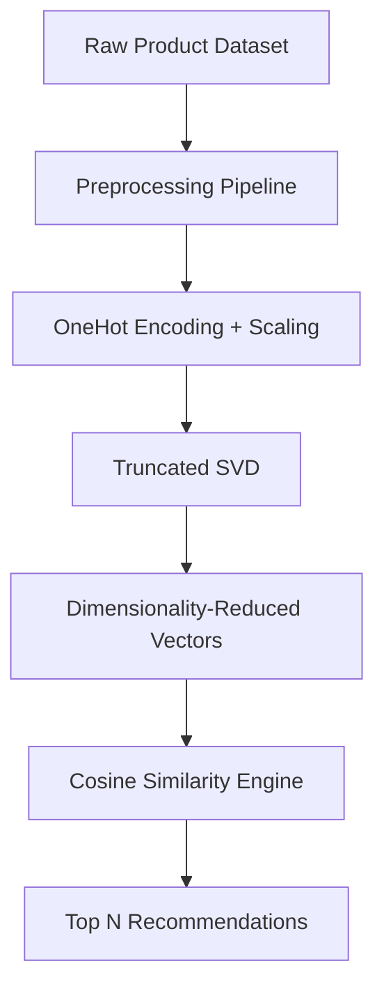

# 🛍️ ML Product Recommender

A powerful, ML-powered product recommendation system built for consumer products. It preprocesses cosmetic product data, applies dimensionality reduction, and delivers personalized, content-based recommendations with a sleek, interactive Streamlit UI. Works great on desktop or in a Dockerized setup.

---

## 🚀 Features

* 🔄 Data preprocessing pipeline with `StandardScaler`, `OneHotEncoder`, and `TruncatedSVD`
* 🧠 Machine learning-based product similarity using **cosine similarity**
* 💡 Real-time recommendations via Streamlit app
* 🎯 Intelligent filters: Brand, Skin Type, Gender, Price, Cruelty-Free, etc.
* 📦 Docker & Docker Compose support
* 📉 Lightweight model (SVD) for blazing-fast inference

---

## 🧩 Tech Stack

* Python 3.9+
* Pandas, NumPy, scikit-learn
* Streamlit
* Joblib
* Docker

---

## 🗃️ Dataset

> The dataset contains structured product data with columns like Brand, Category, Price, Rating, Reviews, Skin Type, Cruelty-Free status, etc.

Key Features:

* Numeric: `Price_USD`, `Rating`, `Number_of_Reviews`
* Categorical: `Brand`, `Skin_Type`, `Gender_Target`, `Cruelty_Free`, etc.

---

## 🧪 How It Works



---

## 🏗️ Project Structure

```
📦 product-recommendation-ml/
├── train.py               # Data preprocessing and SVD model
├── app.py                 # Streamlit app for recommendation
├── Dockerfile             # Docker container setup
├── docker-compose.yml     # For running as a service
├── filtered_data.csv      # Cleaned dataset (auto-generated)
├── X_reduced.npy          # Latent feature matrix (auto-generated)
├── preprocessor.pkl       # Saved pipeline (auto-generated)
├── svd_model.pkl          # Saved SVD model (auto-generated)
└── README.md              # You're reading it!
```

---

## ⚙️ Getting Started

### ✅ 1. Install Requirements

```bash
pip install -r requirements.txt
```

### ✅ 2. Preprocess Data

```bash
python train.py
```

This generates:

* `filtered_data.csv`
* `X_reduced.npy`
* `preprocessor.pkl`
* `svd_model.pkl`

### ✅ 3. Launch App

```bash
streamlit run app.py
```

---

## 🐳 Docker Support

### Build and Run

```bash
docker-compose up --build
```

Then open `http://localhost:8501` in your browser.

---

## 🧠 Recommendation Logic

When a product is selected, the app:

1. Finds its latent representation in the reduced feature space.
2. Computes **cosine similarity** against all other products.
3. Sorts and returns the **top N most similar items**, excluding the original.

---

## 🔒 License

THIS IS LICENSED UNDER **MIT LICENCE**.
